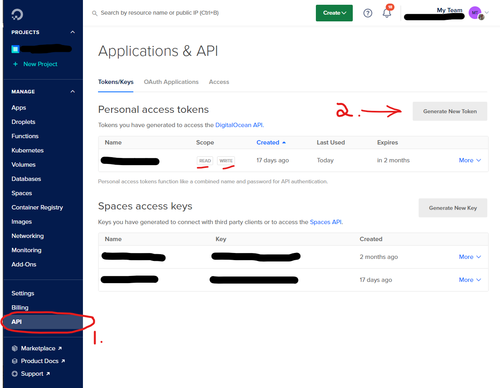
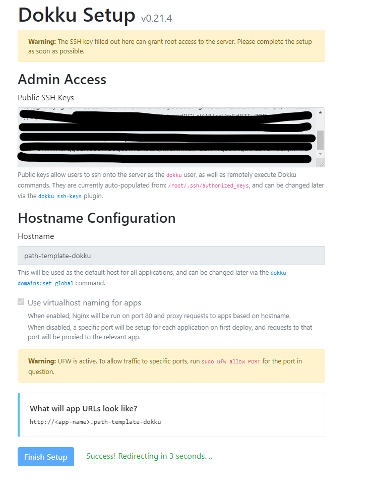

# Miller Web - An easy way to build AND ITERATE a new web product quickly

## initialise the project

I recommend NOT forking the project on Github. Instead, create a new repo and copy the files over.

## Node versions

As of writing this the project uses node 18. I recommend using nvm to manage your node versions and the project has an .nvmrc to help with this.

Install nvm with

```bash
curl -o- https://raw.githubusercontent.com/nvm-sh/nvm/v0.39.3/install.sh | bash
```

There are more detailed instructions here: https://github.com/nvm-sh/nvm#about

When you have nvm you can use the following command to install the correct version of node in a project with an .nvmrc file.

```bash
nvm install && nvm use
```

To change back to your default node version use

```bash
nvm use default
```

## pnpm package manager

The project is built around workspaces and pnpm package manager

Install pnpm with

```bash
npm i -g pnpm
```

## Docker

The project uses docker to run local development backend tools (database, redis). This is already configured for you but you must install docker from https://www.docker.com/products/docker-desktop to use it.

## Initialise your new project

There is a setup helper to get you started for the first run.

This will initialise the project with your own name and description.

```bash
# in the root run
npm run mill:init
```

==========

# Running locally

## Install terraform for your Operating System

install terraform - https://developer.hashicorp.com/terraform/tutorials/aws-get-started/install-cli#install-terraform

## Sign up for Auth0

Auth0 (https://auth0.com/)

Why Auth0? Guaranteed security out of the box. You get 7000 monthly active users for free.

When you are successful and have more users than that, you'll be glad you're using an authentication platform rather than rolling your own. You need MFA, password reset, email verification, and more. Auth0 has it all. You become successful and start working with SAML in enterprise - you just have to turn on some toggles in Auth0.

Create two auth0 tenants

your-app.auth0.com and your-app-dev.auth0.com

## Sign up for Stripe

You must sign up for Stripe to use the payment system.

After you have created a stripe account and you're in the stripe Dashboard, click on the "Developers" link in the left hand menu. Then turn on the "Test Data" toggle.

Now during Miller setup you will be asked for your stripe test api key. You can find this in the "API Keys" section of the stripe dashboard. Take the secret test key. It should start with `sk_test_`. Store it somewhere safe for now.

Next you will need a webhook verification key. This is used to verify the messages that Stripe sends your application about a user's payments. You can find this in the "Webhooks" section of the Developer dashboard.

Click on "Test in local environment" and you'll see some code. Copy the endpoint secret value. It should start with `whsec_`. Store it somewhere safe for now.

# Deploying to production

## Sign up for Digital Ocean

Digital ocean ([My referral link](https://m.do.co/c/1ee4e460bc81) | [Non-referral link](https://www.digitalocean.com/))

Why digitalocean? Straightforward billing and easy to use. You can use any host you like but digitalocean will be the easiest.

You'll need a read and write api key from digital ocean. This will allow terraform to setup the required resources for you.

1. Click on API in the left-hand menu.
1. Click on Generate New Token.
1. Create a read write token.
1. Copy the token somewhere safe for now.



## One-time setup of a suitable dokku droplet

### 1. Create an ssh certificate

You should add an ssh certificate to digital ocean. This is so that you can avoid passwords for logging in later.

Create a new ssh certificate locally on your development machine if you don't already have one.

-   Creating an ssh cert on Mac, linux: https://docs.digitalocean.com/products/droplets/how-to/add-ssh-keys/create-with-openssh/
-   Creating an ssh cert on Windows: https://docs.digitalocean.com/products/droplets/how-to/add-ssh-keys/create-with-putty/

Install digital oceans cli - `doctl` - using the instructions here https://docs.digitalocean.com/reference/doctl/how-to/install/#step-1-install-doctl.

### 2. Authenticate digital ocean

You have to update the variables in the digitalocean-hosting/terraform.tfvars file.

### 3. Run the droplet creation terraform script

```bash
cd digitalocean-hosting

terraform init

terraform plan

terraform apply
```

Take note of the `ipv4` property in the response. When the plan has been applied you MUST open your droplet in a browser to finish configuring.

## First configuration

In the main screen you will see that terraform has already set up the ssh certificate.

If you know your domain you can set it now in the "hostname" field. You can change the hostname later so don't worry too much.

You should check `use virtual naming for apps`. This makes it easy to CNAME urls later.



## Try ssh in to the server

You should be able to ssh into the server now.

```bash
 ssh -i [path/to/your/ssh/key] root@[the.ipv4.address.in.terraform.output]

 # e.g.
 ssh -i ~/.ssh/authorized_keys/mykey root@10.123.123.123
```

You can also use the IP to start configuring your domain name

## Configuring your domain

The setup will configure the apps to use these subdomains by default.

```
Backend: api.yourdomain.com
Frontend App: www.yourdomain.com

```

You will have to configure your own domain host.

Create an `A` record for `api.yourdomain.com` to `10.123.123.123` (replace with your domain and your IP).

You'll probably prefer to host the front end and marketing apps on netlify.

## Running the backend app

```bash
## change to the be directory
cd apps/backend

# run the docker infrastructure
pnpm run up

# development
$ pnpm run start

```

## Test

```bash
# unit tests
$ npm run test

# e2e tests
$ npm run test:e2e

# test coverage
$ npm run test:cov
```

## Migrations

The local migrations must be run on command line
The prod ones will work from the dist build on startup

```bash
# generate new
$ npm run typeorm:migration:generate initWoohoo

# run the migrations
$ npm run typeorm:migration:run
```

## deploying

```bash
# push to remote
git push
```

```shell
# add dokku remote
git remote add dokku dokku@dokkuSERVER:use-miller

# deploy to dokku
git push dokku main:master
```

## ssh in

```
ssh -i ~/.ssh/digioceanMacbook root@165.232.148.97

dokku apps:list

dokku config:show use-miller

dokku config:set use-miller AUTH0_DOMAIN=dev-1degfvs2.au.auth0.com KEY=VAL


```
