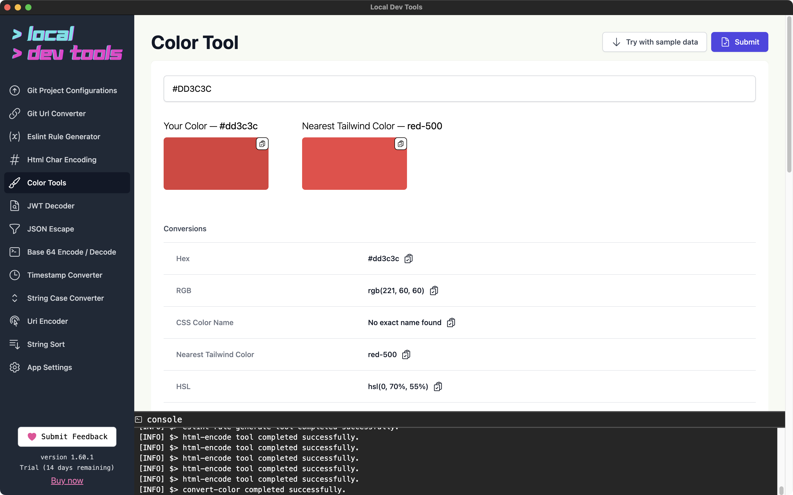
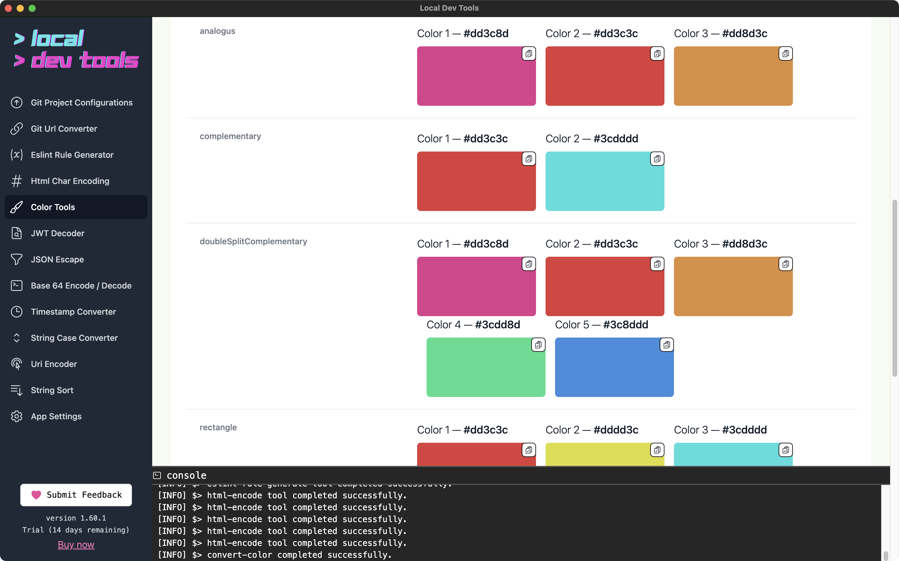

Convert colors between multiple formats and discover related colors. Find the nearest TailwindCSS color match for any color.

## Supported Formats

- **Hex** - `#FF5733`, `#F53`
- **RGB** - `rgb(255, 87, 51)`
- **HSL** - `hsl(14, 100%, 60%)`
- **CMYK** - `cmyk(0%, 66%, 80%, 0%)`
- **HWB** - `hwb(14 20% 0%)`
- **CSS Color Names** - `red`, `coral`, `tomato`

## Features

- **Universal input** - Enter a color in any supported format
- **All conversions** - See the color in every format at once
- **Nearest Tailwind** - Find the closest TailwindCSS color
- **Harmony colors** - Discover complementary and related colors
- **One-click copy** - Copy any format instantly

## How to Use

1. Enter a color value in any format
2. Click "Submit"
3. View conversions and copy what you need
4. Explore harmony colors for design inspiration

## Harmony Colors

The tool shows related colors based on color theory:

- **Complementary** - Opposite on the color wheel
- **Analogous** - Adjacent on the color wheel
- **Triadic** - Three colors equally spaced
- **And more...**

## TailwindCSS Matching

The nearest Tailwind color is shown with its class name (e.g., `red-500`), making it easy to find the right Tailwind class for your design.
