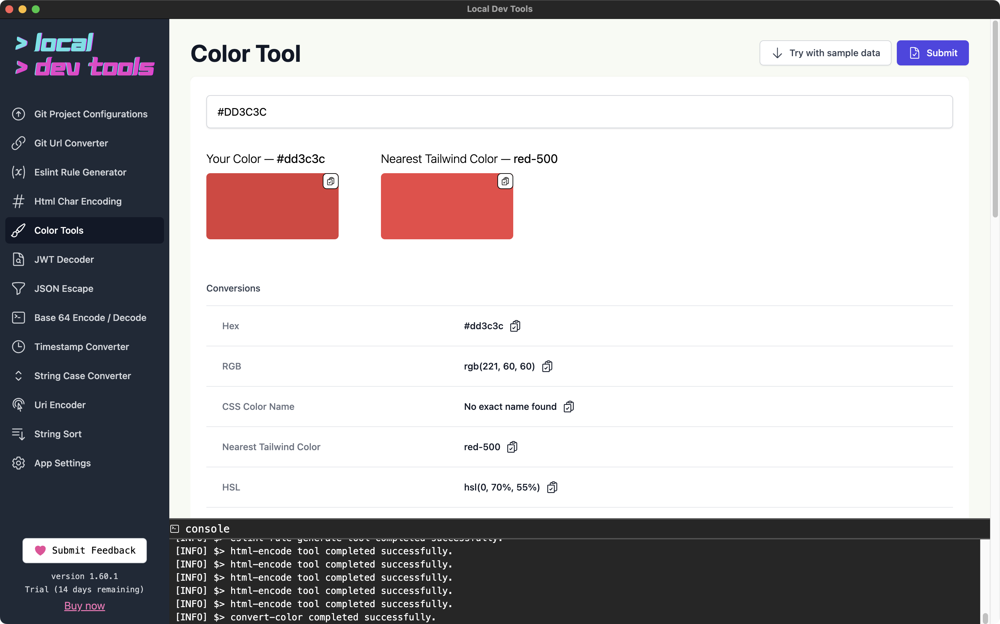
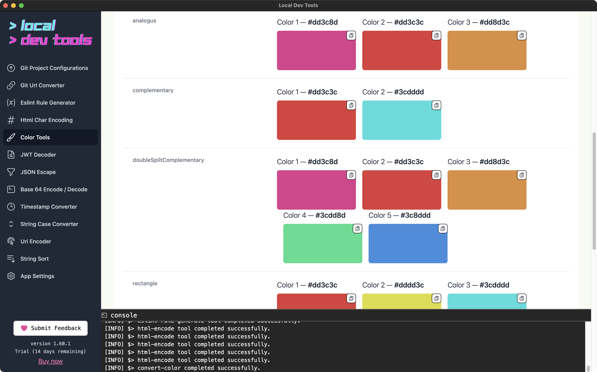

This tool converts colors between different formats.

It shows you the nearest TailwindCSS color to your color.

-   hex
-   rgb
-   hsl
-   css names
-   and more...

It also shows harmony/related colors.

