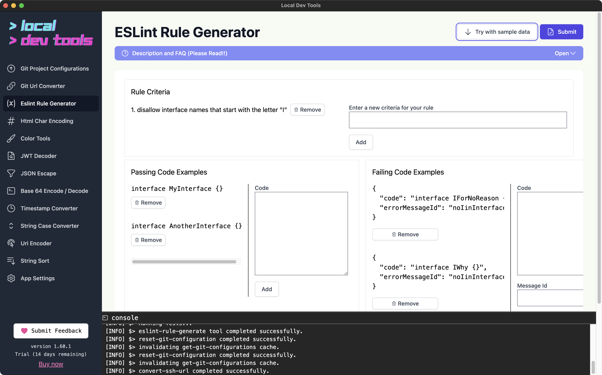
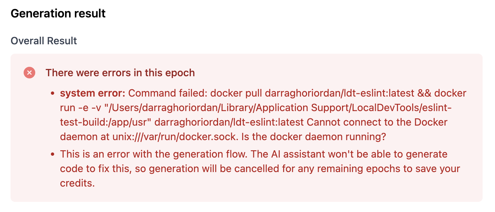

This tool uses AI ChatGPT to generate an ESLint rule.

The rule will be passed to a docker container that will run the rule against the provided tests.

If errors are found, the rule will be updated to fix the errors by AI.

## How to use

You must have added an OpenAI API key to your settings.

You must have docker installed and running.

Enter the rule criteria, passing tests, and failing tests.

Click the "Generate" button.

The console will update with progress. When the generation is complete a result will be available.

## Errors

If you see an error like

then you need to run docker desktop.
