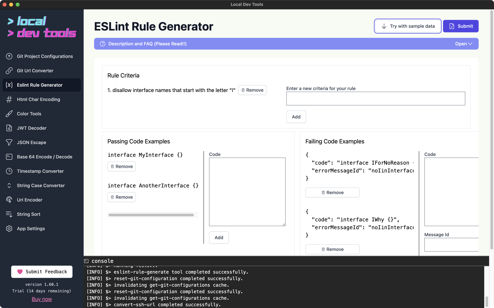
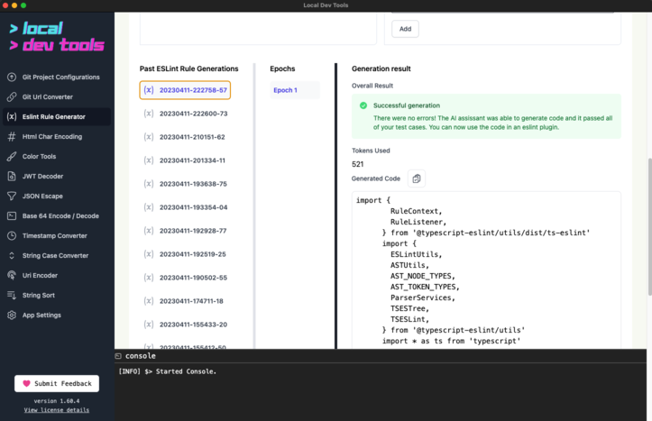
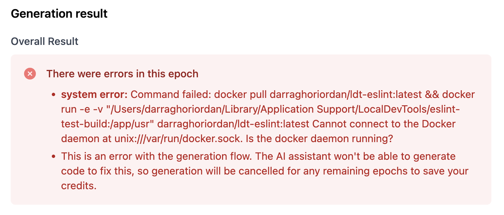

This tool uses AI ChatGPT to generate an ESLint rule.

The rule will be passed to a docker container that will run the rule against the provided tests.

If errors are found, the rule will be updated to fix the errors by AI.

## API Notice

Because this uses ChatGPT your criteria data will be sent to OpenAI.

You use your own API key and the requests go directly to OpenAI. There is no Local Dev Tools server involved.

You can read more about their privacy policy [here](https://openai.com/policies/privacy-policy).

## Initial Setup

You must have added an OpenAI API key to your settings.

You must have docker installed and running.

The first time you use this tool it will download the docker image. This might take some extra time. The rest of the time it will start up quickly. The image is about 300MB.

## How to use

Enter the rule criteria, passing tests, and failing tests.

Click the "Generate" button.

The console will update with progress. When the generation is complete a result will be available.

You can view all the previous rules you've generated. If an error is detected while generating a new "epoch" will be created.

## Errors

If you see an error like

then you need to run docker desktop.
