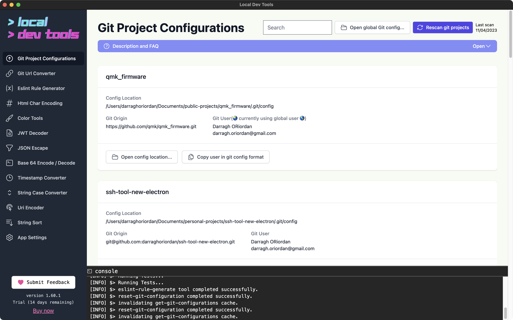

This tool scans your local git projects and displays them in a table.

It focuses on showing you the user that is assigned to a repository so you can easily find misconfigured repos.

It provides easy access to the settings for all your repos in one place. You can also open the global settings easily.

