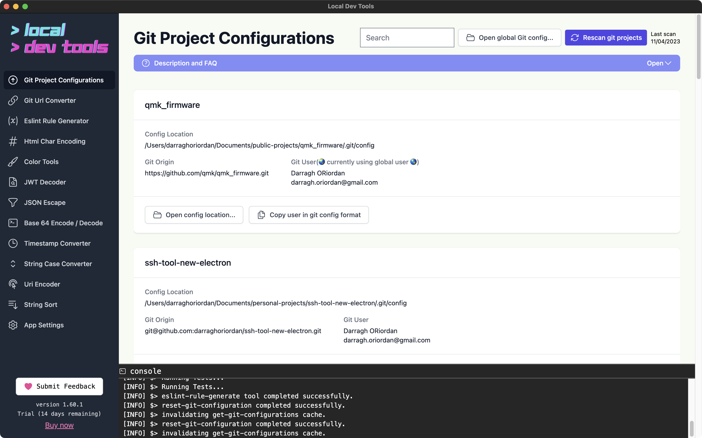

Scan and manage git configurations across all your local repositories from one place. This tool helps you identify misconfigured repos where the commit user doesn't match other repos for the same git host.

## Features

- **Recursive scanning** - Scans a directory for all git repositories
- **User configuration overview** - See which email/name is configured per repo
- **Mismatch warnings** - Get alerted when a repo has a different user than expected for a git host
- **Quick editing** - Open and edit repo configs directly
- **Global config access** - One-click access to your global git config

## How to Use

1. Set your git projects directory in Settings
2. Click "Rescan" to scan for repositories
3. Review the repository list for any warnings
4. Use "Set User" to quickly fix misconfigured repos

## Tabs

- **Repositories** - List of all discovered git repos with their configurations
- **Origin Preferences** - Set your preferred user for each git host (github.com, gitlab.com, etc.)

## Why Use This Tool?

Developers often work with multiple git identities (work vs personal). Committing with the wrong email can cause attribution issues and leak personal information. This tool helps you audit all your repos at once.
