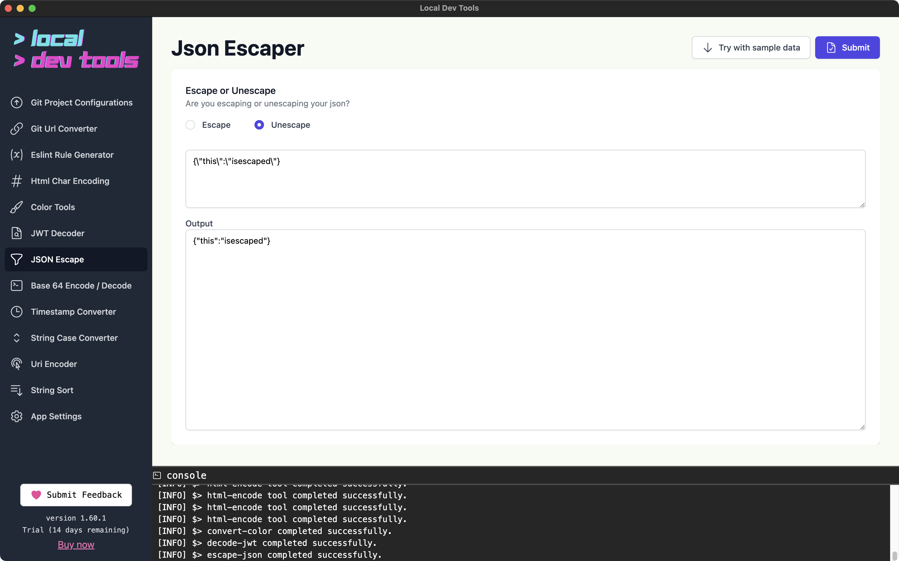

Escape or unescape JSON strings. Useful for handling JSON that's been double-encoded or for preparing strings for use in JSON contexts.

## Features

- **Escape mode** - Add escape characters to special characters in JSON
- **Unescape mode** - Remove escape characters to get the original string

## How to Use

1. Paste your JSON string in the input field
2. Select "Escape" or "Unescape"
3. Click "Submit"
4. Copy the result

## When to Use This

- **Escape**: When you need to embed a JSON string inside another JSON string
- **Unescape**: When you receive JSON that's been double-escaped (common in bash output or API responses)

## Example

Input (escaped): `{\"name\": \"John\"}`

Output (unescaped): `{"name": "John"}`
