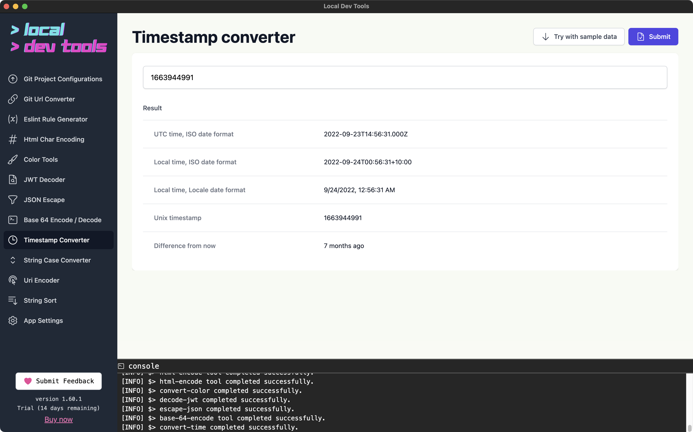

Convert between Unix timestamps and human-readable dates. See times in UTC, local time, and relative to now.

## Features

- **Unix to Date** - Convert Unix timestamps (seconds or milliseconds)
- **Date to Unix** - Convert ISO8601 dates to Unix timestamps
- **Multiple formats** - UTC, local ISO, and locale-formatted output
- **Relative time** - See how long ago or in the future a timestamp is
- **Locale support** - Format dates according to your language/region

## How to Use

1. Enter a Unix timestamp or ISO8601 date
2. Select your preferred locale for formatting
3. Click "Submit"
4. View the converted times

## Output

| Field               | Description                            |
| ------------------- | -------------------------------------- |
| UTC Time            | Time in UTC timezone                   |
| Local Time (ISO)    | ISO8601 format in your timezone        |
| Local Time (Locale) | Formatted according to selected locale |
| Unix Timestamp      | Seconds since January 1, 1970          |
| Difference          | How long ago or until this time        |

## Supported Input Formats

- **Unix seconds**: `1609459200`
- **Unix milliseconds**: `1609459200000`
- **ISO8601**: `2021-01-01T00:00:00Z`
- **ISO8601 with offset**: `2021-01-01T00:00:00+05:30`
