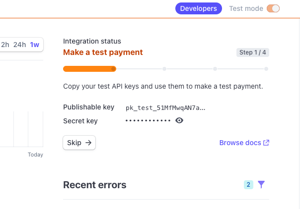
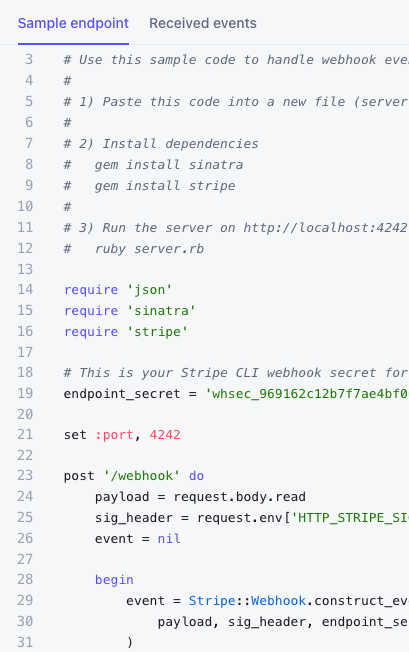

## 1. Copy the files from the repository into your own local repository.

### GitHub forks

I recommend NOT forking the project on Github. Instead, create a new repo and copy the files over in to your new repo. Use diffs like below to see what has changed on the miller repo.

```
# in your new repo
git remote add -f miller_repo https://github.com/darraghoriordan/use-miller.git
git remote update
git diff master remotes/miller_repo/master
git remote rm miller_repo
```

## 2. Minimum requirements

```
node >=20
pnpm >=7.0.0
docker desktop @ latest
terraform >=0.14.0
```

### Node versions and nvm

As of writing, this the project uses node 20. I recommend using nvm to manage your node versions and the project has an .nvmrc to help with this.

Install nvm with

```bash
curl -o- https://raw.githubusercontent.com/nvm-sh/nvm/v0.39.3/install.sh | bash
```

There are more detailed instructions here: https://github.com/nvm-sh/nvm#about

When you have nvm you can use the following command to install the correct version of node in a project with an .nvmrc file.

```bash
nvm install && nvm use
```

To change back to your default node version use

```bash
nvm use default
```

## pnpm package manager

The project is built around workspaces and pnpm package manager

pnpm is a fast, disk space efficient package manager. It is designed to be used in monorepos and workspaces.

Install and update pnpm with

```bash
npm i -g pnpm
```

## Terraform

Terraform is used to manage auth0 and Stripe directly from your project. It ensures consistency in configuration and makes it easy for miller to manage your .env files.

Install terraform for your Operating System

install terraform - https://developer.hashicorp.com/terraform/tutorials/aws-get-started/install-cli#install-terraform

Terraform tracks the state of your infrastructure in a file called terraform.tfstate. Terraform can store this file on your local machine but this means that no other devs can share it. Or if your local machine breaks you will have to re-initialise the state.

Most people use some kind of remote backend to store the state of infrastructure.

I personally use digital ocean spaces for this (spaces are like an s3 bucket) but you can use any remote backend that terraform supports.

You can use the local backend for now but do consider using a remote backend in the future.

## Docker

The project uses docker to run local development backend tools (database, redis). The services are already configured for you but you must install docker from https://www.docker.com/products/docker-desktop to use it.

You must set `127.0.0.1      host.docker.internal` in your `/etc/hosts` file or the equivalent for local dns lookups on your operating system. This might already be done for you by docker installer.

## Initialise your new project

There is a setup helper to get you started for the first run.

This will initialise the project. It performs the following steps:

1. It renames "Miller" type names to your project name
2. It cleans up some files associated with Miller development that don't make sense for your project (e.g. CODEOWNERS)
3. It tries to run terraform for auth0 and stripe.
4. It creates the correct local .env files from the .env.templates and with your stripe and auth0 secrets.

The script will prompt you for secrets from auth0 and stripe. See the following sections on how to get these.

```bash
# in the root run
pnpm run mill:init
```

You can re-run mill:init at any time but it will overwrite `.env` files and these are not in git so you will lose any changes you have made that are not captured in the terraform output.

## Sign up for Auth0

Auth0 (https://auth0.com/)

Why Auth0? Identity and security is vital these days. With a managed identity provider you get guaranteed security out of the box. Auth0 allows for 7000 monthly active users for free so it's perfect for solo builders.

When you are successful and have more users than the free tier, you'll be glad you're using an authentication platform rather than rolling your own. When you need MFA or other advanced features, Auth0 has you covered.

### Miller requirements for local development

For local development you only need 1 development tenant.

At a minimum create a new tenant called `your-app-dev.auth0.com`.

You can create the production tenant later on.

### Create a new Auth0 management API

Auth0 have excellent instructions here: https://registry.terraform.io/providers/auth0/auth0/latest/docs/guides/quickstart

You just need to do the first section. The miller:init command will handle the local configuration steps.

## Sign up for Stripe

You must sign up for Stripe to use the payment system. Stripe is a payment platform that allows you to accept payments from your users. It's a very popular platform and has a lot of features.

After you have created a stripe account and you're in the stripe Dashboard, click on the "Developers" link in the left hand menu. Then turn on the "Test Data" toggle.

You will see the keys in top right hand corner. You need the "Secret Key" value.



It should start with `sk_test_`. Enter this in the Miller init script when asked.

Next you will need a Stripe webhook verification key. This is used to verify the messages that Stripe sends your application about a user's payments. For testing Stripe creates a key for you.

To get the webhook verification key, Click on "Webhooks" > "Test in local environment" and you'll see some code in the window. Copy the `endpoint_secret` value. It should start with `whsec_`. Enter this value in the Miller init script when asked.


