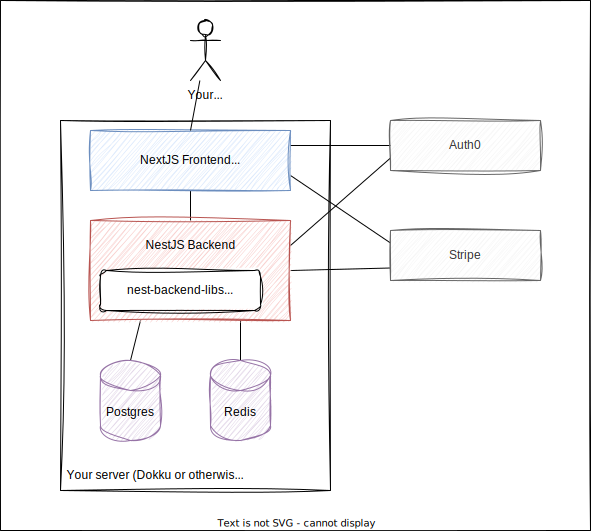

Miller Start is a fullstack application example for learning and building javascript applications.

Miller is designed to give real examples of how to implement common features in a SaaS app. Miller is used to run this website, so every change or fix in this website code is reflected back into the product.

## Miller outline

Miller is a monolithic NestJS backend with a NextJS frontend in a monorepo configuration.

Design principals are:

1. For the solo developer with very little budget (<$500/year)
1. For devs building a product by themselves
1. Likely a very small user base (<5000 DAU).
1. Ability to grow with success - easily extract microservices or serverless functions later
1. Ability to expose the api to clients other than web apps in the future (e.g. a mobile app or ChatGPT plugin).

Miller Start deliberately avoids the use of microservices, kubernetes, serverless and other "cloud first" technologies. It's designed to be simple, easy to understand and easy to manage.

I do realise this may be a controversial statement to some developers, but I use serverless and cloud every day in my day job, so I understand the benefits and also the complexity these technologies bring.

## Who is Miller for?

If you're a more experienced developer, you should find Miller's depth of content very useful.

It uses dependency injection, typescript, linting, testing, CI/CD, docker, terraform and many modern dev tools that encourage consistency and correct our code as we build and help us move faster in the long run. It comes with additional support like custom bash scripts and tools, redis queues, infrastructure-as-code and code quality automations that you will commonly find "production" applications.

If you're a Java or .Net developer learning about NodeJS-land, you will find that Miller is a great way to quickly learn the tools in the NodeJS ecosystem. Everything is typed, dependency injection is used, linting and testing are built-in and the project is designed to be modular and easy extend.

If you're just learning how to code, Miller Start might not be the best tool for you. I don't explain the web stuff in-depth because I assume prior knowledge. [Free Code Camp](https://www.freecodecamp.org/) and [The Odin Project](https://www.theodinproject.com/) are excellent resources for learning how to code web apps.

Tl;dr - Miller is designed for developers who have some prior-experience, or have finished a bootcamp and tutorials and want to continue their learning.

## Miller structure

Miller is a monorepo structure with all applications in one repo and directory.

The backend functionality that is common to most SaaS applications is extracted to a library called `nest-backend-libs`. This library is used by Miller Start and reduces the amount of code in the main application.

You can see these two project structures in the Code Reference section.

The library is modular and you have full access to it. You can just copy-paste the library code into your project to edit, if you don't want to use the library as-is.
