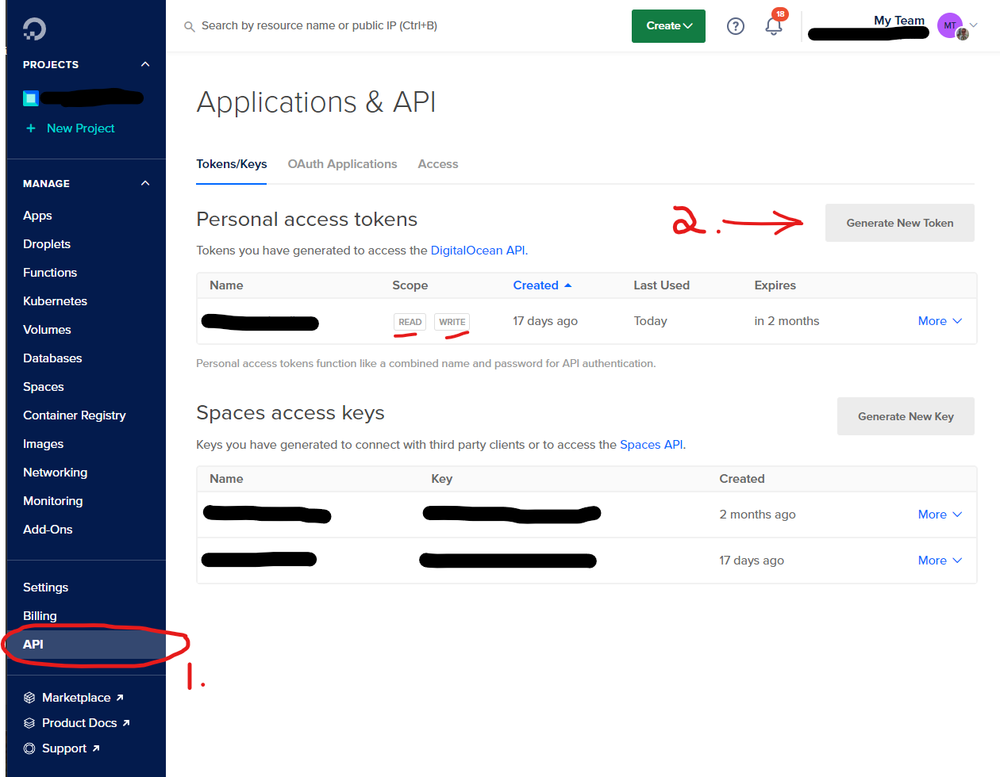

You will want to deploy your application(s) to production at some point. Miller start applications are designed to be deployed to production anywhere that supports NodeJS.

I will discuss how to deploy to Digital Ocean here but the same principals apply to any host. Each different potential host environment will require custom setup.

## Auth0 and Stripe

For auth0 you will have to create a new tenant for production. Just follow the same instructions you used for development environment but select "production" when asked what the environment will be used for.

Stripe gives you the "production" tenant by default. You will need to grab the Api Secret Key again but make sure that the "test" toggle is NOT active. You want the real, non-test api key this time.

Configure both the terraform projects and run them.

Note that the auth0 terraform module will not create any users for production. You can add them manually or create the accounts by loggging in.

You will need the outputs from the terraform projects to configure the frontend and backend in later steps.

## Dokku

Dokku is a free and open source Platform as a Service that runs on a single server of your choice. It is designed to be like Heroku but you can run it on your own hardware.

Dokku is a great choice for solo developers or small teams. It makes it easy to deploy and manage your applications and server security. All networking can be automated for you. It hides your databases and other services from the internet and only exposes the ports you want to expose.

Dokku has a plugin for let's encrypt so you can get free SSL certificates for your applications and it will automatically renew them for you.

## Dokku on digital ocean with Terraform

I provide 2 terraform projects with Miller Start.

1. `infrastructure/production/digitalocean-hosting`
2. `infrastructure/production/dokku-app`

The first one configures the "droplet" - this is like a VM or server - on digital ocean. The second project configures the individual dokku application(s) on the droplet.

The `digitalocean-hosting` terraform project is a one-time setup. You likely only need to run it once to create (and manage) the droplet. You might need to run it again to change the size of the droplet if your app is successful!

The `dokku-app` terraform project is run every time you want to update the variables or other settings of the application on the droplet. You could run more than one Miller Start application on one digitalocean-hosting managed droplet depending on the resource requirements.

Let's set up the droplet first.

## 1. Copy the tfvars template file

Navigate to `infrastructure/production/digitalocean-hosting`.

Copy the `...tfvars.template` file to `....tfvars` and fill in the values as described below.

## 2. Create an ssh certificate

You should add an ssh certificate to digital ocean. This is so that you can avoid passwords for logging in later.

Create a new ssh certificate locally on your development machine if you don't already have one.

-   Creating an ssh cert on Mac, linux: https://docs.digitalocean.com/products/droplets/how-to/add-ssh-keys/create-with-openssh/
-   Creating an ssh cert on Windows: https://docs.digitalocean.com/products/droplets/how-to/add-ssh-keys/create-with-putty/

add the path to the public certificate to the `infrastructure/production/digitalocean-hosting/terraform.tfvars` file.

You MUST add the private key to your ssh agent so that terraform dokku can use it. You can do this by running `ssh-add [path/to/your/ssh/key]` in your terminal.

## 3. Sign up for Digital Ocean

Digital ocean ([My referral link](https://m.do.co/c/1ee4e460bc81) | [Non-referral link](https://www.digitalocean.com/))

You'll need a read and write api key from digital ocean. This will allow terraform to setup the required resources for you.

1. Click on API in the left-hand menu.
1. Click on Generate New Token.
1. Create a read write token.
1. Add the token to the `infrastructure/production/digitalocean-hosting/terraform.tfvars` file.



## (Optional) Install the digital ocean cli

Install digital oceans cli - `doctl` - using the instructions here https://docs.digitalocean.com/reference/doctl/how-to/install/#step-1-install-doctl.

### 4. Apply the droplet creation terraform project

```bash
cd infrastructure/production/digitalocean-hosting

terraform init

terraform plan

terraform apply
```

Take note of the `ipv4` property in the response.

When the plan has been applied you MUST open your droplet in a browser to finish configuring. If you skip this it's a security risk. Newer versions of Dokku allow you to skip this but at time of writing this is not possible.

## 5. First-run dokku configuration

In the main screen you will see that terraform has already set up the ssh certificate.

If you know your domain you can set it now in the "hostname" field. You can change the hostname later so don't worry too much.

You should check `use virtual naming for apps`. This makes it easy to CNAME urls later.


## Try ssh in to the server

You should be able to ssh into the server now.

```bash
 ssh -i [path/to/your/ssh/key] root@[the.ipv4.address.in.terraform.output]

 # e.g.
 ssh -i ~/.ssh/authorized_keys/mykey root@10.123.123.123
```

You can also use the IP to start configuring your domain name

## 6. Configuring your domain name

You will have to configure your own domain host. Every domain host is different but the general idea is the same. I use namecheap purchase and digital ocean to host my domains.

Create an `A` record for `api.yourdomain.com` to `10.123.123.123` (replace with your domain and your IP).

The terraform modules will configure the apps to use these subdomains by default.

```
Backend: api.yourdomain.com
Frontend App: www.yourdomain.com, yourdomain.com
```

## 7. Apply the dokku apps terraform project

Navigate to `infrastructure/production/digitalocean-hosting`.

Copy the `...tfvars.template` file to `....tfvars` and fill in the values for your production instances. None of this is automated because of security concerns. You should manage your own production secrets safely.

```bash
cd infrastructure/production/dokku-app

terraform init

terraform plan

terraform apply

```

## Common management tasks for dokku

```bash
#ssh into the server
ssh -i ~/.ssh/your-cert-name root@165.123.123.123

#list all apps
dokku apps:list

# show current config
dokku config:show use-miller

# set a variable (note - please use tfvars for this instead, but it can be handy to hack in a value temporarily)
dokku config:set use-miller AUTH0_DOMAIN=dev-1degfvs2.au.auth0.com KEY=VAL

```
