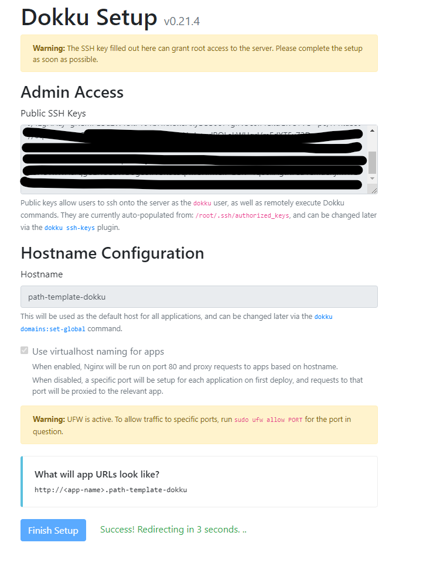

You will want to deploy your application(s) to production at some point. Miller start applications are designed to be deployed to production anywhere that supports NodeJS.

I will discuss how to deploy to Digital Ocean here but the same principals apply to any host. Each different potential host environment will require custom setup.

## Auth0 production

For auth0 you will have to create a new tenant for production. Just follow the same instructions you used for development environment but select "production" when asked what the environment will be used for.

You cannot use development credentials for social logins in production on auth0. You will need to create a new application for each social login provider. You usually do this in the social login provider's developer console. Then add the credentials to the production auth0 tenant.

Run the terraform project to create the auth0 application and configure it.

Note that the auth0 terraform module will not create any users for production. You can add them manually or create the accounts by loggging in.

## Stripe production

Stripe gives you the "production" tenant by default. You will need to grab the Api Secret Key again but make sure that the "test" toggle is NOT active. You want the real, non-test api key this time.

Configure the Stripe terraform project manually and run it. You might have to pop into the Stripe console to grab the webhook key. Terraform will create and configure it for you, but it's not returned in the terraform output.

## Dokku production

Dokku is a free and open source Platform as a Service that runs on a single server of your choice. It is designed to be like Heroku but you can run it on your own hardware.

Dokku is a great choice for solo developers or small teams. It makes it easy to deploy and manage your applications and server security. All networking can be automated for you. It hides your databases and other services from the internet by default and only exposes the ports you want to expose.

Dokku has a plugin for let's encrypt so you can get free SSL certificates for your applications and it will automatically renew them for you.

The platform also supports Docker based deploys which is great for custom backends like the Miller "course files" module example.

## Dokku on digital ocean with Terraform

I provide 2 terraform projects with Miller Start.

1. `infrastructure/production/digitalocean-hosting`
2. `infrastructure/production/dokku-app`

The first one configures the "droplet" - this is like a VM or server - on digital ocean. The second project configures the individual dokku application(s) on the droplet.

The `digitalocean-hosting` terraform project is a one-time setup. You likely only need to run it once to create (and manage) the droplet. You might need to run it again to change the size of the droplet if your app is successful!

The `dokku-app` terraform project is run every time you want to update the variables or other settings of the application on the droplet. You could run more than one Miller Start application on one digitalocean-hosting managed droplet, depending on the resource requirements. I run 3 Miller Start apps on a $6/month droplet.

Let's set up the droplet first.

## 1. Copy the tfvars template file

Navigate to `infrastructure/production/digitalocean-hosting`.

Copy the `terraform.tfvars.template` file to `terraform.tfvars` and fill in the values as described below.

## 2. Create an ssh certificate

You should add an ssh certificate to digital ocean. This is so that you can avoid passwords for logging in later.

Create a new ssh certificate locally on your development machine if you don't already have one.

-   Creating an ssh cert on Mac, linux: https://docs.digitalocean.com/products/droplets/how-to/add-ssh-keys/create-with-openssh/
-   Creating an ssh cert on Windows: https://docs.digitalocean.com/products/droplets/how-to/add-ssh-keys/create-with-putty/

add the path to the public certificate to the `infrastructure/production/digitalocean-hosting/terraform.tfvars` file.

It's a good idea to add the private key to your ssh agent so that terraform dokku can use it. You can do this by running `ssh-add [path/to/your/ssh/key]` in your terminal.

## 3. Sign up for Digital Ocean

Digital ocean ([My referral link](https://m.do.co/c/1ee4e460bc81) | [Non-referral link](https://www.digitalocean.com/))

You'll need a read and write api key from digital ocean. This will allow terraform to setup the required resources for you.

1. Click on API in the left-hand menu.
1. Click on Generate New Token.
1. Create a read write token.
1. Add the token to the `infrastructure/production/digitalocean-hosting/terraform.tfvars` file.


## (Optional) Install the digital ocean cli

Install digital oceans cli - `doctl` - using the instructions here https://docs.digitalocean.com/reference/doctl/how-to/install/#step-1-install-doctl.

### 4. Apply the droplet creation terraform project

```bash
cd infrastructure/production/digitalocean-hosting

terraform init

terraform plan

terraform apply
```

Take note of the `ipv4` property in the response.

When the plan has been applied you MUST open your droplet in a browser to finish configuring. If you skip this it's a security risk. Newer versions of Dokku allow you to skip this but at time of writing this is not possible.

## 5. First-run dokku web configuration

In the main screen you will see that terraform has already set up the ssh certificate.

If you know your domain you can set it now in the "hostname" field. You can change the hostname later so don't worry too much.

You should check `use virtual naming for apps`. This makes it easy to CNAME urls later.



## Try ssh in to the server

You should be able to ssh into the server now.

```bash
 ssh -i [path/to/your/ssh/key] root@[the.ipv4.address.in.terraform.output]

 # e.g.
 ssh -i ~/.ssh/mykey root@10.123.123.123
```

You can also use the IP to start configuring your domain name

## 6. Configuring your domain name

You will have to configure your own domain host. Every domain host is different but the general idea is the same. I use namecheap purchase and digital ocean to host my domains.

Create an `A` records for `api.yourdomain.com`, `yourdomain.com` and `www.yourdomain.com` to `10.123.123.123` (replace with your domain and your IP).

The terraform modules will configure the apps to use these subdomains by default.

```
Backend: api.yourdomain.com
Frontend App: www.yourdomain.com, yourdomain.com
```

## 7. Apply the dokku apps terraform project

Navigate to `infrastructure/production/digitalocean-hosting`.

Copy the `terraform.tfvars.template` file to `terraform.tfvars` and fill in the values for your production instances.

This might take a bit of time. None of this is automated because of security concerns. You should manage your own production secrets safely.

When you're ready, apply the terraform project.

```bash
cd infrastructure/production/dokku-app

terraform init

terraform plan

terraform apply

```

## Special configuration for the git repos in Miller build

You probably wont need this for your custom application.

For Miller I clone the "Code Reference" repo code right into the container. You have to be careful with SSH on docker containers because SSH keys would be baked into the image. This is a security issue. I use the mounted volume to get around this.

```bash
# (from your dev machine) scp the certs for GitHub deploy keys to the dokku ssh directory
scp macSetupScript dokku-as-darragh:/home/dokku/.ssh
scp useMiller dokku-as-darragh:/home/dokku/.ssh
scp nestBackendLibs dokku-as-darragh:/home/dokku/.ssh

# (on dokku droplet) make sure certs are owned by the dokku builder
chown dokku:dokku /home/dokku/.ssh/useMiller
chown dokku:dokku /home/dokku/.ssh/macSetupScript
chown dokku:dokku /home/dokku/.ssh/nestBackendLibs

# update the docker build commend arguments on dokku to have named ssh key mounts
dokku docker-options:add use-miller build '--ssh usemiller=$HOME/.ssh/useMiller --ssh macsetup=$HOME/.ssh/macSetupScript --ssh nestbackend=$HOME/.ssh/nestBackendLibs'
```

## Configure dokku for Docker deploys

You must configure the dokku apps to have the right ports and certs for docker deploys.

I recommend using Let's Encrypt for ssh if you're using dokku. It's free and easy to set up. The initial configuration of let's encrypt is described on the dokku website.

```bash
# To change dokku apps to support docker deploy
# remove the existing "buildpack" config
dokku config:unset --no-restart use-miller-frontend DOKKU_PROXY_PORT_MAP
dokku config:unset --no-restart use-miller DOKKU_PROXY_PORT_MAP

# if using multiple docker files set the file
dokku builder-dockerfile:set use-miller-frontend dockerfile-path Dockerfile-fe
dokku builder-dockerfile:set use-miller dockerfile-path Dockerfile-be
# you should try to deploy now
# (on your dev machine)
git remote add dokku dokku@YOURdokkuSERVER:use-miller
git remote add dokkufe dokku@YOURdokkuSERVER:use-miller-frontend

git push dokku main:master
git push dokkufe main:master

# set the ports (after a successful deployment)
dokku proxy:ports-add use-miller-frontend http:80:5000
dokku letsencrypt:enable use-miller-frontend
dokku proxy:ports-add use-miller-frontend https:443:5000

dokku proxy:ports-add use-miller http:80:5000
dokku letsencrypt:enable use-miller
dokku proxy:ports-add use-miller https:443:5000

# these port mappings are added automatically by dokku but aren't needed
dokku proxy:ports-remove use-miller http:5000:5000
dokku proxy:ports-remove use-miller-frontend http:5000:5000
```

## Common management tasks for dokku

```bash
#ssh into the server
ssh -i ~/.ssh/your-cert-name root@165.123.123.123

#list all apps
dokku apps:list

# show current config
dokku config:show use-miller

# the frontend proxy buffering can be too small for some apps
dokku nginx:set use-miller-frontend proxy-buffer-size 128k
dokku nginx:set use-miller-frontend proxy-buffers "4 256k"
dokku nginx:set use-miller-frontend proxy-busy-buffers-size 256k
```

## Maintaining space on the droplet

You can cleanup old docker images and containers to save space on the droplet. This will also cleanup logs and old apt packages.

```bash
docker system prune
sudo apt-get autoremove
sudo apt-get autoclean
sudo journalctl --vacuum-time=5d

```
